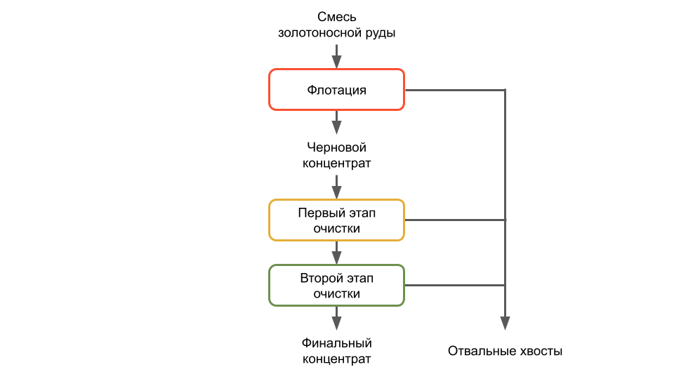

# Предсказание коэффициента восстановления золота из руды

## Стек

- EDA: `Matplotlib`, `pandas`, `seaborn`
- Подготовка данных и обучение моделей: `CatBoost`, `Optuna`, `scikit-learn`

## Задача

Построить для компании-разработчика цифровых промышленных решений модель для предсказания коэффициента восстановления золота из золотосодержащей руды:

- эффективность обогащения чернового концентрата (`rougher.output.recovery`); и
- эффективность обогащения финального концентрата (`final.output.recovery`).

Модель должна демонстрировать наименьшее возможное значение `sMAPE`. Итоговая метрика складывается из двух величин:

$$\text{Итоговое sMAPE} \ \= 25 \\% \ * \text{ sMAPE (rougher) } + \ 75 \\% \ * \text{ sMAPE (final)}$$

Модель поможет оптимизировать производство, чтобы не запускать предприятие с убыточными характеристиками.

## Технологический процесс восстановления золота из руды

## Предоставленные данные

Данные об обработке золотосодержащей руды в форме трех файлов:
- `gold_recovery_full.csv` — весь датасет;
- `gold_recovery_train.csv` — обучающая выборка;
- `gold_recovery_test.csv` — тестовая выборка.

Наименование признаков соответствует формату:
`[этап].[тип_параметра].[название_параметра]`

Возможные значения для блока `[этап]`:

- `rougher` — флотация;
- `primary_cleaner` — первичная очистка;
- `secondary_cleaner` — вторичная очистка;
- `final` — финальные характеристики.

Возможные значения для блока `[тип_параметра]`:

- `input` — параметры сырья;
- `output` — параметры продукта;
- `state` — параметры, характеризующие текущее состояние этапа;
- `calculation` — расчётные характеристики.

## Основные этапы работы

Работа над задачей включала шесть этапов:

1. загрузка и первичное изучение данных;
2. исследовательский анализ данных;
3. подготовка данных для обучения моделей;
4. обучение моделей; и
5. тестирование моделей.

## Результат работы

По результатам работы заказчику была предложена модель `CatBoostRegressor`, которая показала лучшие значения метрик `sMAPE` на этапе `final` (9.43) и `total sMAPE` (9.38). Значение метрики `total sMAPE` модели `CatBoostRegressor` на 9% лучше аналогичного значения константной модели, предсказывающей среднее значение. 

Чтобы дополнительно улучшить значение метрики `total sMAPE`, целесообразно использовать комбинированную модель, состоящую из моделей `Ridge` (для предсказаний на этапе `rougher`) и `CatBoostRegressor` (для предсказаний на этапе `final`).
